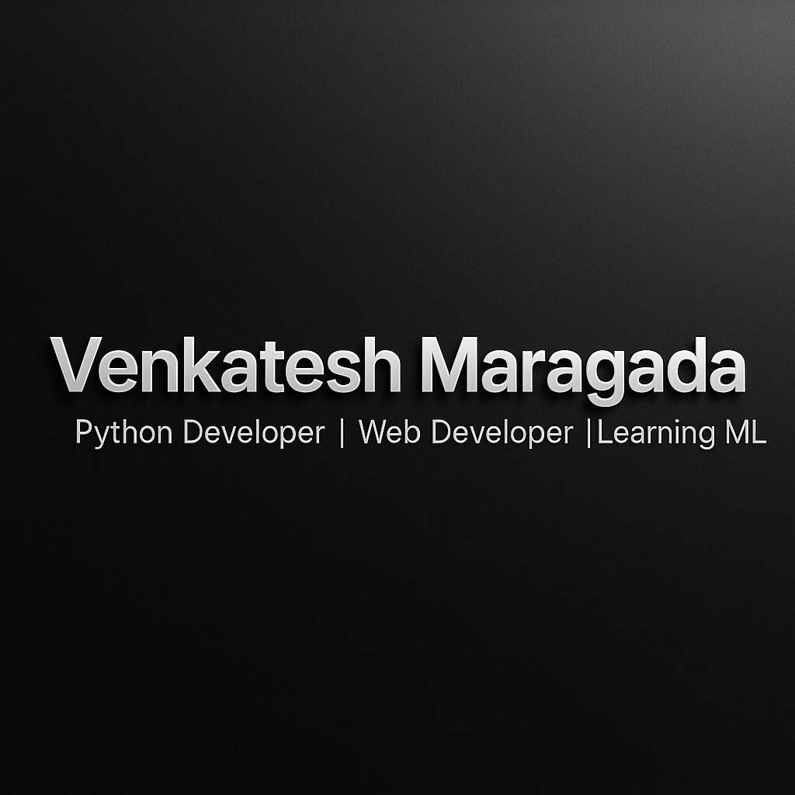

<!-- 3D Glossy Dark Banner -->

  

<!-- Wavy Section (capsule-render) -->

  

<!-- Black content area using table bgcolor for consistent rendering -->
<table width="100%" cellpadding="0" cellspacing="0" border="0" bgcolor="#000000">
  <tr>
    <td align="center" style="padding-top:20px; padding-bottom:20px;">

### 👋 Hi there, I'm **Maragada Venkateswara Reddy**  
💻 Python Developer | 🌐 Web Enthusiast | 🤖 Exploring Machine Learning

---

### 🧠 About Me  
I'm a Mechanical Engineering student turned **Web Developer**, blending analytical problem-solving with creativity.  
Passionate about **Python**, **modern web technologies**, and always learning new frameworks to improve my backend and frontend skills.  
Currently exploring how **machine learning** can enhance real-world applications.

---

### ⚙️ Skills & Tools  

---

### 📈 GitHub Stats & Activity  
  
  

---

### 🧭 Contribution Overview  

✨ *Coding consistently to learn, improve, and build meaningful projects.*

---

### 📂 Featured Repositories  
#### 🔹 [Calculator-Ctk](https://github.com/Venkatesh-6921/Calculator-Ctk)  
*A modern GUI calculator built using Python and CustomTkinter.*

#### 🔹 [Employee Management System](https://github.com/Venkatesh-6921/Employee_Management)  
*A Django-based web app for managing employee data with SQLite.*

---

### 📬 Connect  

    </td>
  </tr>
</table>

<!-- Footer wave -->

  

